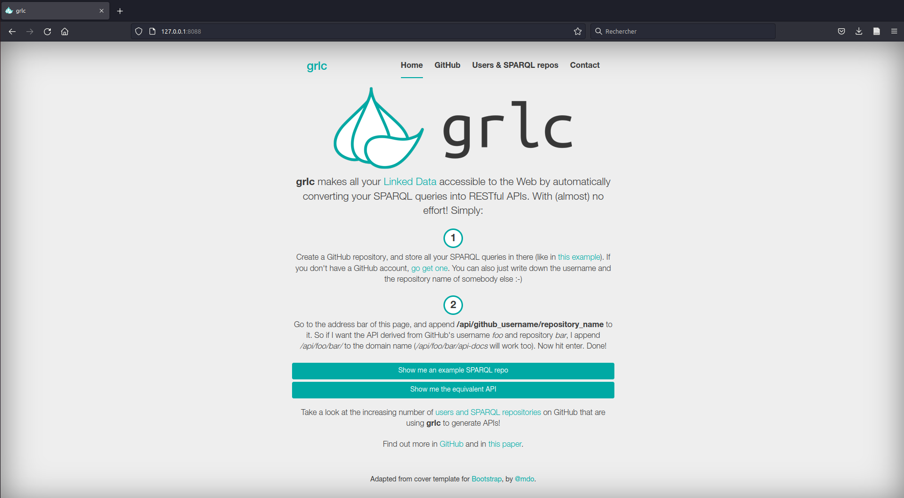
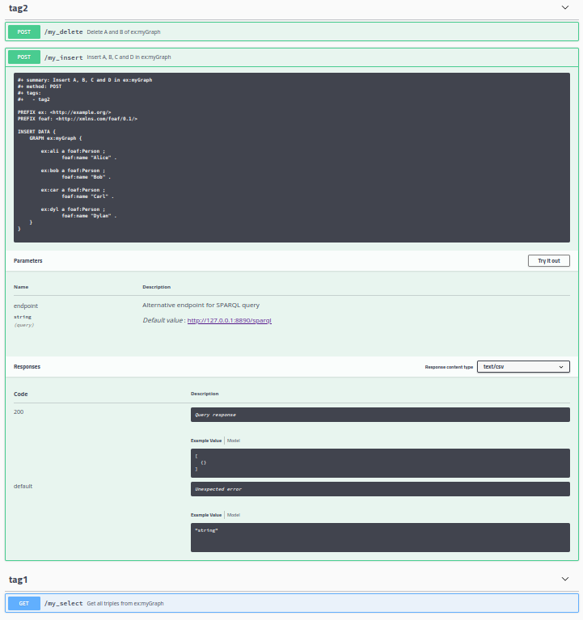

# GRLC_fork
This project is a fork of the project GRLC.  
The GRLC project is available at: https://github.com/CLARIAH/grlc

**What is GRLC ?**  
GRLC is a lightweight server that takes SPARQL queries (stored in a GitHub repository, in your local filesystem, or listed in a URL), and translates them to Linked Data Web APIs.  
This enables universal access to Linked Data. Users are not required to know SPARQL to query their data, but instead can access a web API.

**Fork improvements**  
This fork brings 2 major improvements:
- SPARQL UPDATE request are supported
- Access to queries stored in a GitLab repository

**Usage details**  
For more details on using GRLC, see the original GRLC project and the additional examples provided below.


## Table of content
- [Quick start](#quick-start)
- [API configuration](#api)
    - [local_api](#local_api)
    - [url_api](#url_api)
    - [github_api](#github_api)
    - [gitlab_api](#gitlab_api)
- [Queries examples](#example)
  - [Queries](#queries)
  - [UI](#ui)
- [Citation (original work)](#citation-original-work)
- [Contribute](#contribute)
- [License](#license)
- [Maintainer](#maintainer)


## Quick start <a id="quick-start"></a>

1. Install this package
    1. clone the repository
    2. build package: in the base folder, execute `python3 setup.py build`
    3. install package: in the pase folder, execute `python3 setup.py install`
2. Write the file `config.ini`
3. In the same directory of the `config.ini`, execute: `python3 -m grlc_fork`  

Then you can access the GRLC UI from a Web browser (e.g. http://127.0.0.1:8088), or the GRLC API with HTTP query tools (e.g. cURL, see details provided in the GRLC Web UI).  



## API configuration <a id="api"></a>
This application can reach SPARQL queries stored in one of this 4 locations:
- [Local file system](#local_api)
- [URL](#url_api)
- [GitHub](#github_api)
- [GitLab](#gitlab_api)

Configuration examples for each of these are provided below.


### local_api <a id="local_api"></a>
An example of a `config.ini`:
```ini
[server]
host = 127.0.0.1                         ; host of the api
port = 8088                              ; port of the api
    
[endpoint]    
url = http://127.0.0.1:8890/sparql       ; url of the endpoint
user = none                              ; user of the endpoint
password = none                          ; password of the endpoint
    
[log]    
level = critical                         ; possible values: critical | error | warning | info | debug | notset
    
[api_local]    
sparql_dir = /path/to/my/queries         ; path to the folder which contains the queries
```
The URL for accessing the Web interface follows this schema: `http://<host>:<port>/api-local`  
With this `config.ini` it gives: `http://127.0.0.1:8088/api-local`


### url_api <a id="url_api"></a>
An example of a `config.ini`:
```ini
[server]
host = 127.0.0.1                         ; host of the api
port = 8088                              ; port of the api
    
[endpoint]    
url = http://127.0.0.1:8890/sparql       ; url of the endpoint
user = none                              ; user of the endpoint
password = none                          ; password of the endpoint
    
[log]    
level = critical                         ; possible values: critical | error | warning | info | debug | notset
```
The URL for accessing the Web interface follows this schema: `http://<host>:<port>/api-url`  
With this `config.ini`, it gives: `http://127.0.0.1:8088/api-url`


### github_api <a id="github_api"></a>
An example of a `config.ini`:
```ini
[server]
host = 127.0.0.1                         ; host of the api
port = 8088                              ; port of the api
    
[endpoint]    
url = http://127.0.0.1:8890/sparql       ; url of the endpoint
user = none                              ; user of the endpoint
password = none                          ; password of the endpoint
    
[log]    
level = critical                         ; possible values: critical | error | warning | info | debug | notset
    
[auth]    
git_access_token = xxx                   ; github token
```
The URL for accessing the Web interface follows this schema: `http://<host>:<port>/api-github`  
With this `config.ini`, it gives: `http://127.0.0.1:8088/api-github`


### gitlab_api <a id="gitlab_api"></a>
An example of a `config.ini`:
```ini
[server]
host = 127.0.0.1                         ; host of the api
port = 8088                              ; port of the api

[endpoint]
url = http://127.0.0.1:8890/sparql       ; url of the endpoint
user = none                              ; user of the endpoint
password = none                          ; password of the endpoint

[log]
level = critical                         ; possible values: critical | error | warning | info | debug | notset

[auth]
git_access_token = xxx                   ; github token

[api_gitlab]
gitlab_url = https://gitlab.xxx          ; gitlab url
```
The URL for accessing the Web interface follows this schema: `http://<host>:<port>/api-gitlab`  
With this `config.ini`, it gives: `http://127.0.0.1:8088/api-gitlab`  
You can reach a specific branch and a specific subdir: `http://<host>:<port>/api-gitlab/<user-or-group>/<repository>/branch/<branch>/subdir/<subdir>`  


## Queries examples
Queries examples provided below illustrate how both SPARQL UPDATE and typical SPARQL SELECT can be declared.
The resulting GRLC UI is shown in the [UI section](#ui) below.

We assume the following directory structure:
```
|
└───my_delete.rq
└───my_insert.rq
└───my_select.rq
```

### Queries <a id="queries"></a>

#### my_delete.rq
```sparql
#+ summary: Delete A and B of ex:myGraph
#+ method: POST
#+ tags:
#+   - tag2

PREFIX ex: <http://example.org/>
PREFIX foaf: <http://xmlns.com/foaf/0.1/>

DELETE DATA {
    GRAPH ex:myGraph {
        
        ex:ali a foaf:Person ;
               foaf:name "Alice" .
        
        ex:bob a foaf:Person ;
               foaf:name "Bob" .
    }
}
```

#### my_insert.rq
```sparql
#+ summary: Insert A, B, C and D in ex:myGraph
#+ method: POST
#+ tags:
#+   - tag2

PREFIX ex: <http://example.org/>
PREFIX foaf: <http://xmlns.com/foaf/0.1/>

INSERT DATA {
    GRAPH ex:myGraph {
        
        ex:ali a foaf:Person ;
               foaf:name "Alice" .
        
        ex:bob a foaf:Person ;
               foaf:name "Bob" .
        
        ex:car a foaf:Person ;
               foaf:name "Carl" .
        
        ex:dyl a foaf:Person ;
               foaf:name "Dylan" .
    }
}
```

#### my_select.rq
```sparql
#+ summary: Get all triples from ex:myGraph
#+ method: GET
#+ tags:
#+   - tag1

PREFIX ex: <http://example.org/> 

SELECT ?s ?p ?o
FROM ex:myGraph
WHERE {
    ?s ?p ?o .
}
```


### UI <a id="ui"></a>

The following screenshot shows the resulting GRLC UI with above-mentioned queries examples.
Focus is set on a query involving SPARQL UPDATE features.




## Citation (original work) <a id="citation-original-work"></a>
```yaml
authors:
  -
    affiliation: "King's College London"
    family-names: Meroño-Peñuela
    given-names: Albert
    orcid: "https://orcid.org/0000-0003-4646-5842"
  -
    affiliation: "Netherlands eScience Center"
    family-names: Martinez
    given-names: Carlos
    orcid: "https://orcid.org/0000-0001-5565-7577"
cff-version: "1.0.3"
doi: 10.5281/zenodo.1064391
license: MIT
message: "If you use this software, please cite it as below."
repository-code: "https://github.com/CLARIAH/grlc"
title: "grlc: the git repository linked data API constructor"
abstract: grlc, the git repository linked data API constructor, automatically builds Web APIs using SPARQL queries stored in git repositories.
keywords:
  - "swagger-ui"
  - sparql
  - "linked-data"
  - "semantic-web"
  - "linked-data-api"
version: "1.3.7"
date-released: 2021-11-03
```


## Contribute <a id="contribute"></a>

Generally speaking, we aim at including the *Orange-OpenSource/grlc* features into the original *[GRLC](https://github.com/CLARIAH/grlc)* project through pull requests.
For contributions specific to *Orange-OpenSource/grlc*, please select one of the following:

:point_right:  Create an issue or a [Merge Request].

:point_right:  See `TODO` tags in code for things to develop or think about.


## License <a id="license"></a>

[MIT](LICENSE.txt)


## Maintainer <a id="maintainer"></a>
- [Mihary RANAIVOSON](mailto:mihari.ranaivoson@orange.com)
- [Lionel TAILHARDAT](mailto:lionel.tailhardat@orange.com)
- [Yoan CHABOT](mailto:yoan.chabot@orange.com)
